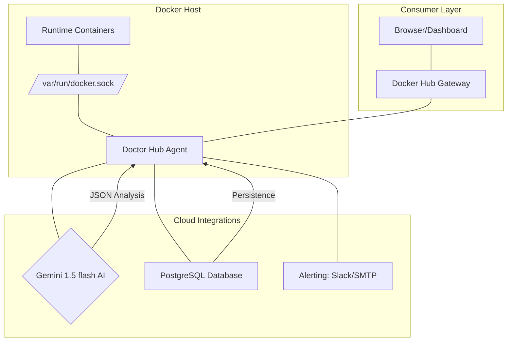

# 🩺 Container Doctor - Advanced SaaS Multi-Image Monitoring

The **Container Doctor** is a production-grade SaaS observability platform designed to monitor, diagnose, and auto-heal containerized environments. By leveraging the **Gemini 1.5 Pro** LLM, the system transforms raw Docker logs and state metrics into actionable, human-readable insights with automated remediation capabilities.

---

## 🏗️ System Architecture

The application follows a **"Hub-and-Spoke"** architecture where a central observability agent (the Hub) manages local and remote containerized workloads.

### 🧩 High-Level Component Flow


---

## ⚙️ How It Works: Internal Logic

### 1. The Monitoring Loop
The **Doctor Hub** initiates a high-concurrency background thread (`monitor_containers`) that polls the Docker SDK every `CHECK_INTERVAL` seconds. 
- **State Check**: Detects containers that are `exited`, `dead`, or `created` but not running.
- **Pattern Matching**: Scans the tail of STDOUT/STDERR logs for specific error signatures (e.g., `exception`, `panic`, `errno 500`).
- **Telemetry**: Aggregates images into **Namespaces** (based on Docker Networks) and **Projects** (based on Docker Compose labels).

### 2. AI-Driven Diagnostic Pipeline
When an anomaly is detected, the **Gemini AI Engine** is triggered:
1. **Context Extraction**: The Hub fetches the last `LOG_LINES` and performs an `inspect` call to gather environment variables and resource constraints.
2. **Prompt Synthesis**: A structured prompt is sent to Gemini, providing the raw logs and identified error patterns.
3. **JSON Synthesis**: Gemini parses the logs and returns a strict JSON payload containing:
    - **Root Cause**: A technical explanation of the failure.
    - **Severity**: Low, Medium, or High.
    - **Auto-Restart Safe**: Boolean flag indicating if a restart will fix or worsen the state.
    - **Remediation**: Specific config changes or target file edits.

### 3. Alerting & Notification Flow
Based on the Gemini diagnosis, the **Multi-Channel Alerting Engine** executes:
- **Slack**: ARich-text block formatted notification with severity-coded headers.
- **Email**: A comprehensive diagnostic report sent via TLS-encrypted SMTP.
- **Infrastructure Context**: Every alert includes the specific **Namespace** and **Image Group** to ensure rapid localization.

---

## 💉 Auto-Healing & Persistence

The "Doctor" isn't just an observer; it's a healer.

- **Crash-Loop Prevention**: The system maintains a state lock in the **PostgreSQL** `container_state` table. If a container is restarted, the Hub tracks the `last_restart` timestamp. To prevent infinite loops, further auto-restarts are blocked for **60 minutes** for that specific container.
- **Event Ledger**: Every diagnosis, terminal transition, and restart attempt is logged in the `events` table for historical audit trails and timeline visualization in the dashboard.

---

## 📡 API Reference Table

| Endpoint | Method | Response Payload | Purpose |
| :------- | :----- | :--------------- | :------ |
| `/stats` | `GET` | `total_images`, `tracked_images`, `broken_containers` | real-time KPI overview metrics. |
| `/images` | `GET` | Nested Namespace -> Image Tree | Hierarchy explorer for all cluster workloads. |
| `/history` | `GET` | Event list (last 50) | Persistent timeline of system state changes. |
| `/diagnostics/<name>` | `GET` | Full Gemini JSON Document | In-depth root-cause analysis for a specific node. |
| `/images/track/<p>` | `POST` | `{"project": "X", "tracked": bool}` | Dynamically toggle monitoring scope for specific images. |

---

## 🚀 Deployment

1. **Configure Environment**: Set `GEMINI_API_KEY`, `SLACK_WEBHOOK_URL`, and `DATABASE_URL` in `.env`.
2. **Launch Stack**:
```bash
docker compose up -d --build
```

## 🧑‍💻 Technical Stack
- **Engine**: Python 3.12 (Flask, Docker-SDK, Psycopg2).
- **AI Layer**: Google Generative AI (Gemini 1.5 Pro).
- **Storage**: PostgreSQL 15 (Relational persistence).
- **UI**: Modern Vanilla JS (Glassmorphism design).

---

