# 🩺 Container Doctor: Enterprise AI-Sentinel & Observability Suite (v35.0)

**Container Doctor** is a production-grade, autonomous observability and self-healing platform designed for modern, high-density Docker environments. It transforms raw container telemetry into a high-reasoning diagnostic stream, leveraging **Groq-Powered Llama-3 Reasoning**, **Persistent Learning RAG Memory**, and **Kafka-native Event Sourcing** to detect, analyze, and resolve system failures with zero human intervention.

---

## 🏗️ 1. System Working Architecture

The platform is built on a **Decoupled 5-Layer Distributed Architecture**, ensuring that monitoring overhead is near-zero while diagnostic reasoning is senior-SRE level.

### 📊 Architectural Flow Diagram
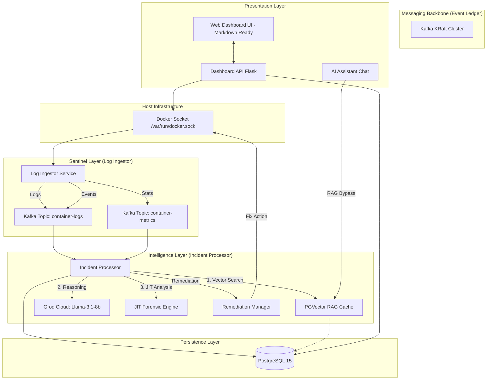

---

## 🧩 2. Component Deep-Dive

### 📡 A. Log Ingestor (The Sentinel Pulse)
The `log_ingestor` is the eyes and ears of the system. It runs as a low-overhead daemon that:
- **Mounts the Docker Socket**: Directly listens to `/var/run/docker.sock` using the Docker SDK.
- **Multi-Threaded Telemetry**:
    - **Log Streamer**: Attaches to `stdout/stderr` of all containers and pipes them to Kafka.
    - **Metric Sampler**: Polls real-time resource usage (CPU/RAM/Disk IO) with 0.01 precision.
    - **Event Monitor**: Detects `die`, `oom`, `kill`, and `start` events instantly.
- **Non-Invasive**: Unlike traditional sidecars, it does not inject agents into your application containers.

### 🧠 B. Incident Processor (The Reasoning Brain)
The `incident_processor` is where raw data turns into intelligence. It operates on a **3-Tier Analysis Pipeline**:
1.  **PGVector RAG Layer**: Converted logs are vectorized using `all-MiniLM-L6-v2`. If a similar log has been seen before (90%+ similarity), the system instantly applies the previous resolution.
2.  **Groq Reasoning Tier (Llama-3.1)**: If the issue is new, the payload is sent to Groq. The system prompt instructs the AI to return *only* a valid JSON diagnostic with root causes and specific bash remediation commands.
3.  **JIT Forensic Engine**: For nodes missing historical data, Sentinel triggers a **Just-In-Time** log harvest to provide immediate reasoning for "silent" failures.

### 🛠️ C. Dashboard API (The Management Hub)
A high-performance Flask REST layer that:
- **State Hygiene**: On startup, it clears "Ghost" incidents if containers have manually returned to health.
- **Executive Shell Proxy**: Safely routes Docker CLI commands from the UI. It is **CWD-Aware**, tracking navigation (e.g., `cd /var/log`) across the session.
- **AI Assistant Chat**: A RAG-backed DevOps chatbot that handles infrastructure queries with a 85% similarity bypass for instant responses.
- **Markdown Engine**: Implements `marked.js` for structured, easy-to-read AI technical advice.

### 💾 D. Persistence Layer (The Time-Capsule)
- **Postgres + PGVector**: Stores every incident permanently. It doesn't just log errors; it stores *knowledge*.
- **Historical Metrics**: Stores resource usage trends used by Chart.js to render telemetry graphs.

---

## 🔄 3. Detailed Data Flow

1.  **CRASH**: A container (e.g., `api`) crashes due to a Segmentation Fault.
2.  **DETECTION**: `log_ingestor` catches the `die` event and the final line of logs.
3.  **INGESTION**: A JSON packet is pushed to Kafka: `{"container": "api", "log": "Segfault at 0x0... "}`.
4.  **ANALYSIS**: `incident_processor` picks it up. 
    - *Is it in RAG?* No. 
    - *Ask Groq?* Yes. 
5.  **DIAGNOSIS**: Groq returns: `{"root_cause": "Memory Leak", "suggested_fix": "docker restart api"}`.
6.  **HEALING**: The system marks the incident as `open` in the DB and triggers a Slack alert.
7.  **VISUALIZATION**: The Dashboard shows a pulsing red alert with the "Audit Data" button.
8.  **INTERACTION**: The SRE opens the "Executive Shell". The UI tracks the **Working Directory** as the SRE navigates to logs to verify the fix.

---

## 💾 3. Deep-Dive Persistence (Database Schema)

We leverage **PostgreSQL 15** with the **PGVector** extension. The system moves away from ephemeral logging to **Permanent Knowledge Accumulation**.

### A. Operational Events (`events` table)
| Field | Type | Description |
| :--- | :--- | :--- |
| `id` | SERIAL | Primary Key. |
| `container` | VARCHAR | Target node name (e.g., `api`). |
| `event_type` | VARCHAR | `diagnosis`, `remediation_attempt`, `ANOMALY_ALARM`, `SYSTEM_HEALED`. |
| `status` | VARCHAR | `open`, `resolved`, `dlq`. |
| `details` | JSONB | High-fidelity AI payload (source, severity, fix, confidence). |
| `timestamp` | DATETIME | IST (Indian Standard Time) normalized. |

### B. High-Precision Metrics (`metrics` table)
| Field | Type | Description |
| :--- | :--- | :--- |
| `cpu_percent` | NUMERIC(5,2) | 64-bit precision CPU usage. |
| `mem_usage_mb` | FLOAT | Absolute memory consumption. |
| `mem_limit_mb` | FLOAT | Node memory ceiling. |
| `disk_read_mb` | FLOAT | Historical I/O throughput. |

### C. RAG Knowledge (`incident_knowledge` & `chat_knowledge`)
| Field | Type | Description |
| :--- | :--- | :--- |
| `query/signature`| TEXT | Raw log trace or user question. |
| `embedding` | VECTOR(384) | 384-dimensional semantic representation. |
| `answer/fix` | TEXT | Validated reasoning or remediation command. |

---

## 🔬 4. AI Model Benchmarking

The system uses a **Tri-Tier Model Strategy**:
- **Groq Llama-3.1-8b**: Ultra-low latency (400ms) deep reasoning for forensics.
- **all-MiniLM-L6-v2**: Optimized for fast vector embeddings (384 dimensions) on CPU.
- **Markdown Formatter**: Enforces structured, technical responses for the AI Assistant.

---

## 🛠️ 8. Operational Lifecycle (Step-by-Step Flow)

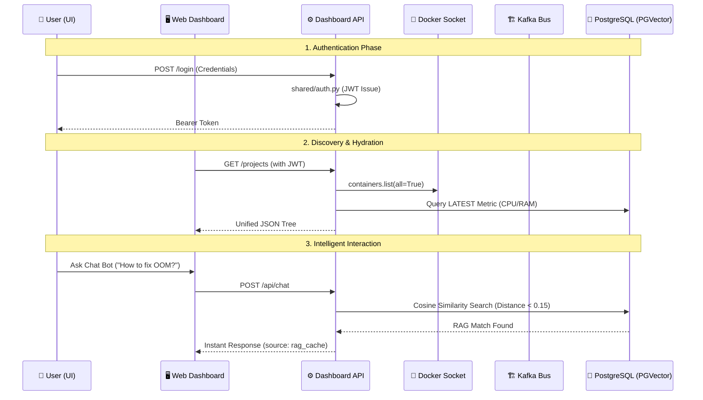

---

## ⚙️ 9. Setup & Deployment

```bash
# Ignite the Sentinel Cluster
docker compose up -d --build

# Verify Connectivity
docker ps # Ensure all services are healthy

# Monitor Real-time Intelligence
docker logs -f dashboard_api
```

---

## 🏆 9. Why Container Doctor?

Unlike generic log aggregators, **Container Doctor** is *actionable*. It doesn't just store data; it **analyzes** with Llama-3 reasoning, **learns** with RAG memory, and **heals** with autonomous decisions. It provides a **Context-Aware Shell** and **Dynamic Resource Patching** to close the gap between detection and resolution.

---

## 💾 10. Application Pictures

1. **Login Page**  
   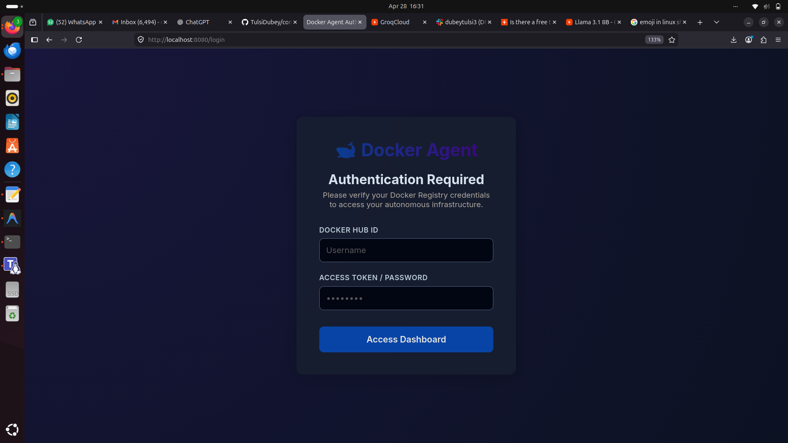

2. **Dashboard View**  
   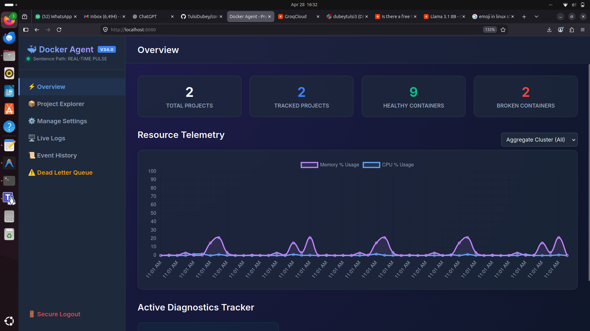

3. **Project Explorer**  
   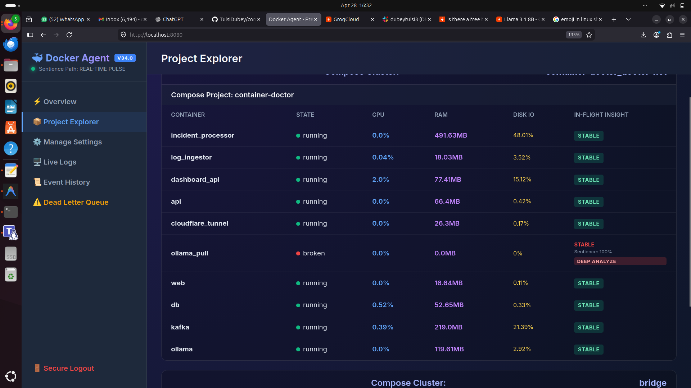

4. **Broken Container Details**  
   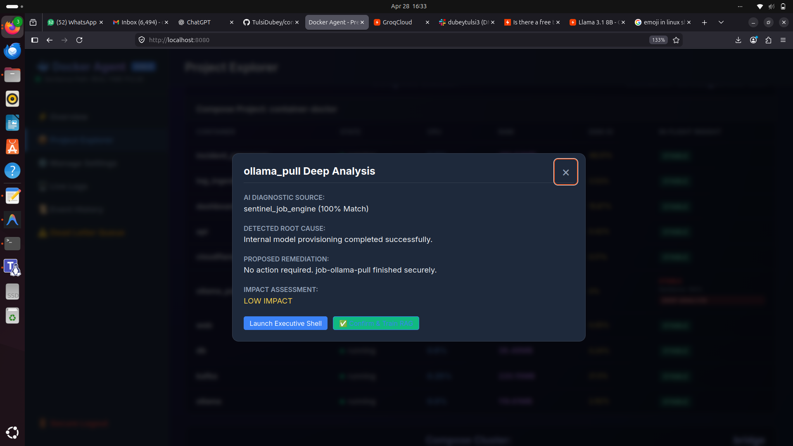

5. **Executive Shell (CWD-Aware)**  
   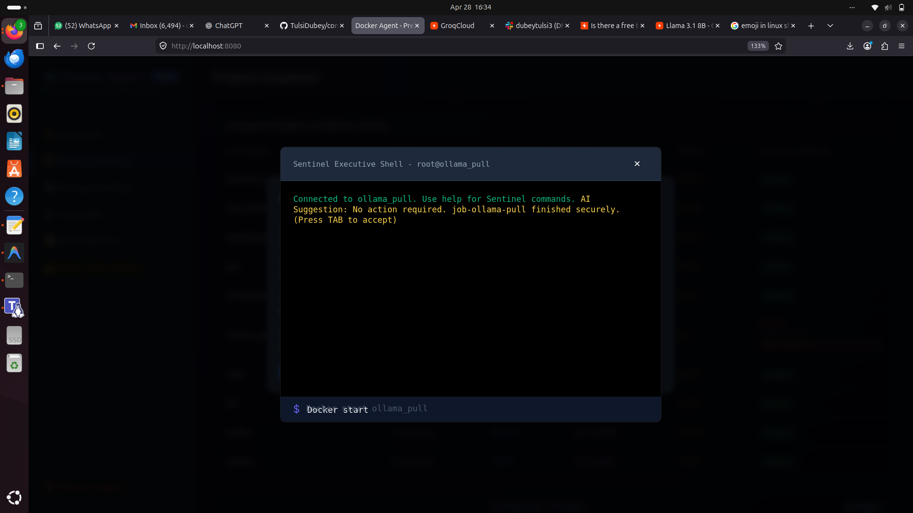

6. **Searchable Live Logs**  
   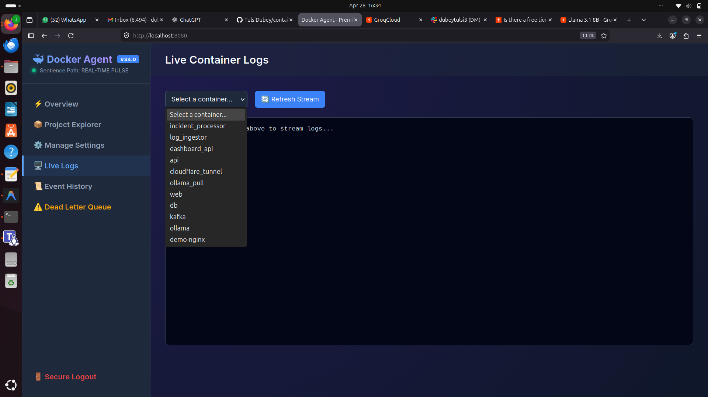

7. **Event History**  
   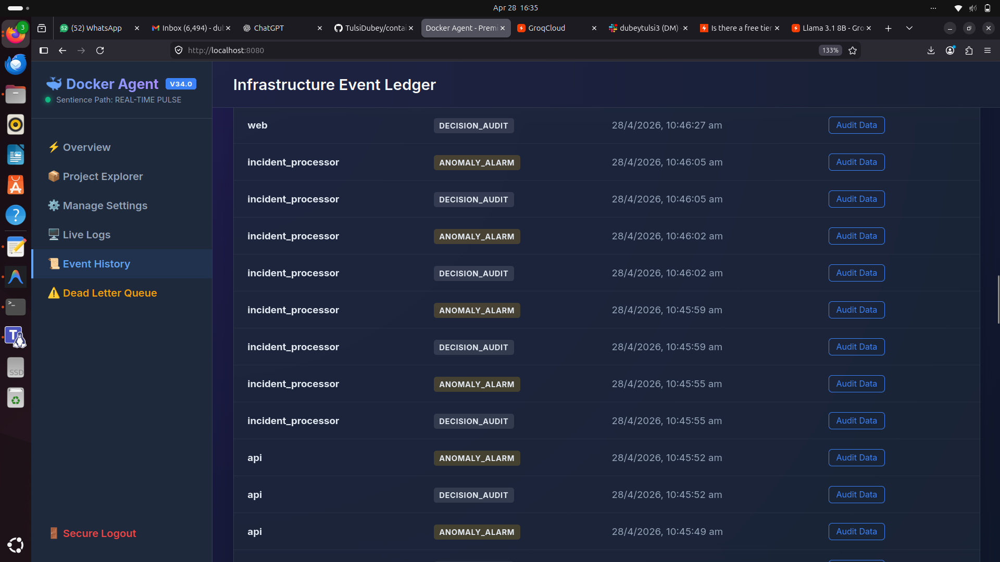

8. **Audit Data**  
   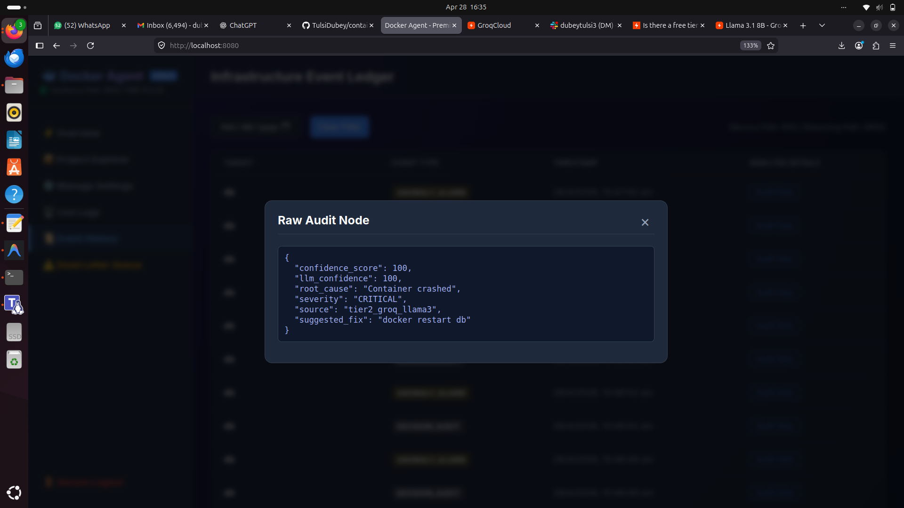

9. **DLQ (Dead Letter Queue)**  
   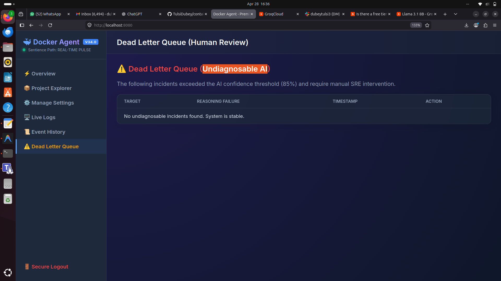

10. **Slack AI Alerts**  
    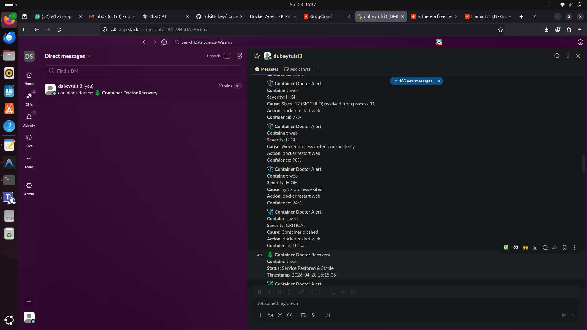

---
*© 2026 Container Doctor - Sentinel v35.0 - Sentience in Infrastructure.*
