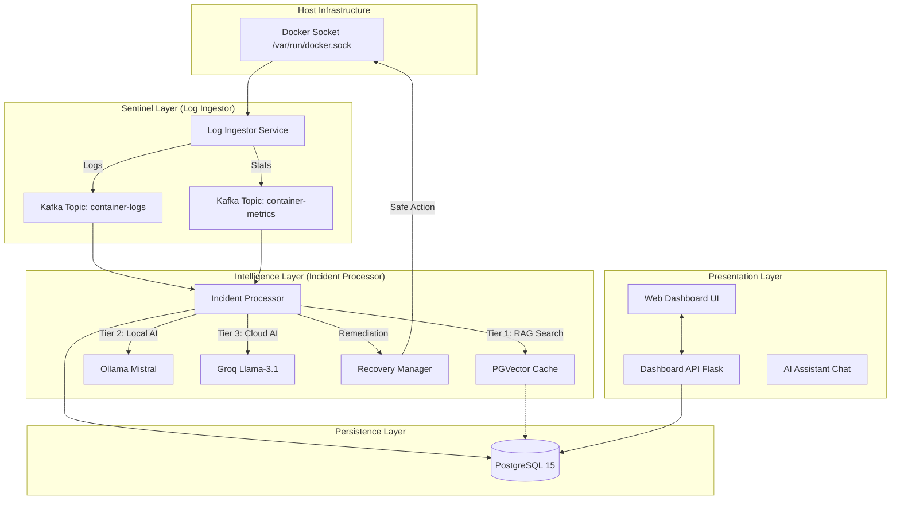

# 🩺 Container Doctor: Enterprise AI-Sentinel & Observability Suite (v40.0)

**Container Doctor** is a production-grade, autonomous observability and self-healing platform designed for modern, high-density Docker environments. It transforms raw container telemetry into a high-reasoning diagnostic stream, leveraging **Groq-Powered Llama-3 Reasoning**, **Persistent Learning RAG Memory**, and **Kafka-native Event Sourcing** to detect, analyze, and resolve system failures with zero human intervention.

---

## 🏗️ 1. System Working Architecture

The platform is built on a **Decoupled 5-Layer Distributed Architecture**, ensuring that monitoring overhead is near-zero while diagnostic reasoning is senior-SRE level.

### 📊 Architectural Flow Diagram


---

## 🛡️ 2. Reliability & Safety Tier

Sentinel v40.0 implements a **Defense-in-Depth** safety strategy:

- **Executive Shell Blacklist**: Intercepts destructive commands (`rm -rf`, `chmod 777`) at the API layer.
- **Circuit Breaker**: Auto-remediation is limited to 3 attempts per hour to prevent flapping loops.
- **Action Whitelist**: Only safe, predefined actions (e.g., `restart`) are executed autonomously.
- **Infrastructure Exemption**: Core platform nodes (`db`, `kafka`, `api`) are monitored but never autonomously restarted to avoid circular failure paths.
- **Resilient Kafka Producer**: Log ingestor uses a local memory buffer to survive Kafka downtime.
- **Predictive Failure Detection**: New memory trend analysis triggers alerts *before* OOM crashes occur.

---

## 🧪 3. SRE Validation & Chaos Testing

To validate the platform's resilience, use the built-in **Chaos Simulation Suite**.

### 🛠️ Running the Simulator
```bash
# Execute from the project root
./scripts/chaos_simulator.sh
```

### 🧪 Failure Scenarios
| Test Case | System Reaction | Validation Metric |
|-----------|-----------------|-------------------|
| **Manual Kill** | Detects `die` event -> Triggers JIT Diagnosis | Recovery Time < 5s |
| **Log Injection** | `log_ingestor` captures error string -> AI Reasoning | Root Cause Accuracy |
| **Kafka Drop** | Producer shifts to local memory buffer | Zero Data Loss |
| **Memory Pressure** | OOM Detection -> Self-Healing (Restart) | Stability Persistence |
| **Rising Memory Trend**| **[v40 NEW]** Predictive Anomaly Alarm | Pre-emptive Detection |

---

## 📊 4. Observability & System Health

The v40.0 Dashboard provides **self-monitoring** for the Sentinel platform itself:

- **RAG Hit Rate**: Tracks how often historical knowledge resolves current issues.
- **Avg AI Confidence**: Monitors the certainty level of the reasoning tier.
- **PGVector Sync**: Real-time status of the knowledge hub.
- **Dynamic Registry**: Real-time de-linking of projects from monitoring via the UI.

---

## 🔄 5. Detailed Data Flow

1.  **DETECTION**: `log_ingestor` catches a `die` event or error log.
2.  **INGESTION**: A JSON packet is pushed to Kafka.
3.  **ANALYSIS**: 
    - **Tier 1 (RAG)**: Instant match search (90%+ similarity).
    - **Tier 2 (Ollama)**: Local triage (Optimized for memory v40).
    - **Tier 3 (Groq)**: Deep cloud reasoning for complex forensics.
4.  **REMEDIATION**: `RecoveryManager` validates the fix against safety rules and executes.
5.  **NOTIFICATION**: Slack alert dispatched with root cause and resolution status.

---

## 🚀 6. Getting Started

1.  **Clone the Repo**: `git clone ...`
2.  **Environment Setup**:
    - Add `GROQ_API_KEY` to `.env`.
    - Add `SLACK_WEBHOOK_URL` for alerts.
3.  **Launch Sentinel**:
    ```bash
    docker compose up -d --build
    ```
4.  **Access Dashboard**: Open `http://localhost:8080`.

---
*© 2026 Container Doctor - Sentinel v40.0 - Sentience in Infrastructure.*
